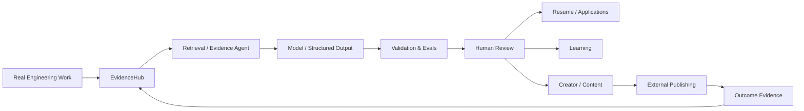

# SoloScale AI OS

**A local-first, human-controlled applied AI workflow system for turning real engineering work into verified evidence, learning workflows, job artifacts, and publishable proof.**

[**Watch the Hero Demo →**](https://soloscale-showcase.vercel.app/showcase/soloscale-hero-demo-v1)

> Current package: `0.4.1` · Python `3.11+` · Local-first · Human-controlled

**Engineering signals:** agentic workflows · RAG / evidence retrieval · structured model outputs · deterministic validation · provider routing · OAuth integrations · CLI / local UI / macOS · pytest / Ruff / strict mypy

---

## What this repository demonstrates

| Engineering area | SoloScale implementation |
| --- | --- |
| Agentic workflows | Bounded planner, executor, reviewer, and human-gate contracts with deterministic state and receipts outside the model |
| State & recovery | Explicit state transitions, persisted run continuity, bounded model/retrieval retries, timeouts, completion checks, and approval receipts |
| RAG / evidence | Local SQLite + FTS knowledge index, bounded retrieval, evidence citations, hash lineage, and claim validation |
| Structured AI outputs | Pydantic-validated model contracts keep generated candidates separate from verified facts and approved outputs |
| Evaluation | Synthetic retrieval/context gates plus citation-lineage, schema, packaging, and deterministic acceptance checks |
| Provider routing | Local Ollama, an explicit OpenAI-compatible path, a hosted gateway, and optional local MLX—with no implicit provider fallback |
| Human-in-the-loop AI | Public, paid, destructive, credential, and irreversible actions remain explicitly gated |
| Developer tooling | Python package, CLI, local web UI, versioned Skills, receipts, and inspectable run artifacts |
| Productization | Optional native macOS desktop app and Remotion / TypeScript video-rendering surfaces |
| External integrations | YouTube OAuth/upload, read-only GitHub metadata, LinkedIn/X handoffs, and a paid-operation-gated HeyGen provider |
| Engineering quality | pytest, Ruff, strict mypy, deterministic checks, and package/build validation |

---

## Why SoloScale exists

Most AI demos stop when the model returns an answer.

Real AI products have to handle everything around that answer:

* What evidence was retrieved?
* What is the model allowed to infer?
* What happens when a step fails?
* Who owns retries and state transitions?
* How is an output validated?
* When should a human approve an external action?
* How can real engineering work become reusable evidence instead of disappearing after the task is complete?

SoloScale is my exploration of those applied AI engineering problems.

Instead of giving an autonomous agent unlimited control, **code owns the execution loop** while models operate inside bounded roles.

```text
REAL WORK
   ↓
EVIDENCE / RETRIEVAL
   ↓
MODEL REASONING
   ↓
VALIDATION / EVAL
   ↓
HUMAN REVIEW
   ↓
RESUME · LEARNING · CONTENT · EXTERNAL ACTION
```

---

## Current product surface

### Work & Evidence

SoloScale captures structured evidence from real engineering activity and turns it into reusable inputs for downstream workflows.

The local Evidence system combines:

* engineering artifacts
* Git metadata
* local Codex session data
* operator-supplied ChatGPT exports
* project runs and validation artifacts
* external outcome metadata

Retrieval is bounded and treated as untrusted input. Retrieved text can support reasoning, but retrieval alone does not authorize a public claim.

### Resume & Applications

A job description plus an operator-supplied candidate profile can produce:

* targeted resume drafts
* skill–evidence graphs
* explicit evidence gaps
* reviewable application bundles

Candidate facts remain separate from retrieval candidates.

### Engineering Learning

Resolved engineering work can become structured interview practice through:

```text
Explain → Trace → Rebuild → Debug → Defend
```

Completing software work does not automatically imply human mastery.

### Creator & Content

Verified engineering evidence can be transformed into reviewable:

* LinkedIn drafts
* X threads
* technical stories
* diagrams
* video/storyboard packages

External publication remains human-controlled.

---

## Architecture



The model helps reason and generate.

**Code owns control flow.**

State transitions, retry budgets, timeouts, approvals, validation, and completion checks remain deterministic.

---

## Tech stack

### Core

* Python 3.11+
* Pydantic
* Typer
* Rich
* SQLite + FTS
* pytest
* Ruff
* strict mypy

### AI / model integrations

* Ollama
* MLX
* configurable OpenAI-compatible endpoints
* hosted provider gateway
* structured model outputs

### External integrations

* Google / YouTube OAuth and upload
* LinkedIn / X handoffs through BuildLog
* read-only GitHub metadata
* HeyGen behind an explicit paid-operation gate

BuildLog is a separate downstream project and is not vendored in this repository. SoloScale keeps only the adapter and handoff boundary needed to stage compatible publishing workflows.

### Product surfaces

* Python package
* CLI
* local web UI
* native macOS desktop app
* Remotion / TypeScript video rendering

---

## Hero Demo

The public Hero Demo shows the product workflow rather than only describing the architecture.

**[Open SoloScale Hero Demo v1 →](https://soloscale-showcase.vercel.app/showcase/soloscale-hero-demo-v1)**

---

## Quick start

```bash
python3 -m venv .venv
source .venv/bin/activate

pip install -e '.[dev]'

soloscale demo
python -m soloscale.local_ui
```

The local UI opens at:

```text
http://127.0.0.1:8765
```

Run the engineering checks:

```bash
pytest
ruff check .
mypy src tests
```

---

## Representative CLI workflows

```bash
soloscale task-create \
  --title "..." \
  --goal "..." \
  --repo "..." \
  --branch "..."

soloscale knowledge-sync

soloscale evidence-agent "your question"

soloscale case-create \
  --case-id "..." \
  --title "..." \
  --project "..."

soloscale control-tower-build
```

---

## Repository map

```text
src/soloscale/      Core product domains and adapters
tests/              Deterministic test suite
desktop/macos/      Native macOS desktop application
video_factory/      Remotion / TypeScript video renderer
media_runtime/      Optional local MLX worker
packaging/macos/    Desktop backend packaging
.agents/skills/     Versioned bounded agent Skills
docs/               Architecture, ADRs, and operating documentation
examples/           Dogfood and example inputs
scripts/            Bootstrap, demo, validation, and packaging utilities
```

---

## Design principles

### Models reason; code controls

Models are useful for planning, interpretation, extraction, and generation.

They do not silently own retries, irreversible actions, or completion semantics.

### Retrieval is evidence, not truth

Retrieved text can inform a decision.

It does not automatically become a verified fact or public claim.

### Human control stays explicit

Publishing, spending, destructive operations, credential changes, and other irreversible actions remain behind explicit human gates.

### The system should be inspectable

Important decisions produce structured state, evidence, validation results, or receipts that can be inspected later.

---

## Project status

SoloScale is an actively developed applied AI engineering project and dogfood environment.

It demonstrates implemented engineering workflows and product surfaces.

It does **not** claim:

* production customer adoption
* measured commercial demand
* enterprise multi-tenancy
* fully autonomous external execution

Those boundaries are intentional and documented.
