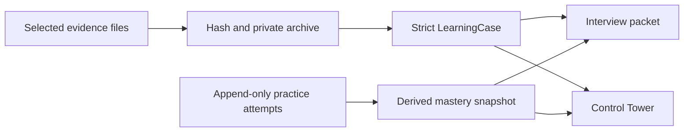
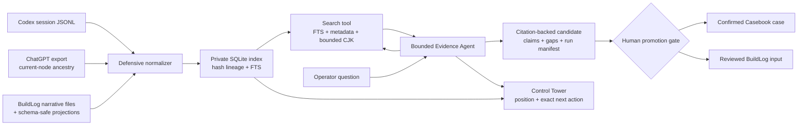
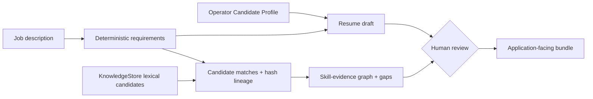
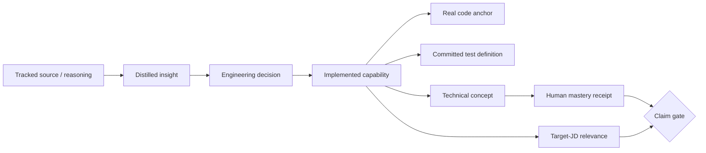
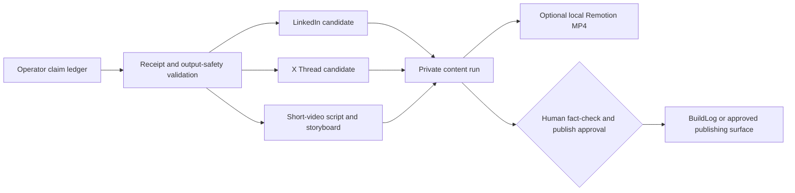
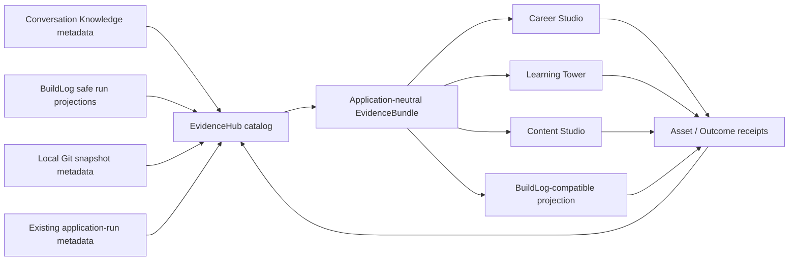
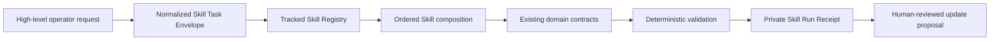
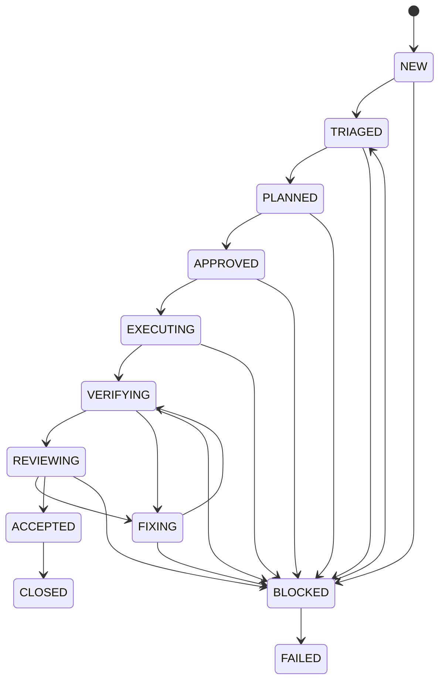
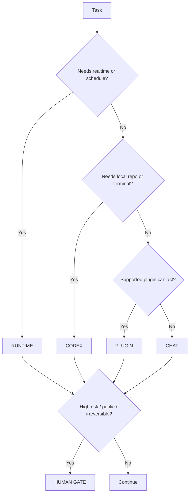

# Architecture

## 1. System boundaries

SoloScale has three related planes with separate execution and trust boundaries.

### Personal control plane

The operator uses ChatGPT Chat and plugins directly. Chat outputs a compact artifact instead of trying to programmatically expose a paid subscription.

### Planned automated runtime plane

In v0.3 and later, API-backed roles and the Codex SDK will execute workflows when
realtime, scheduled, or unattended operation is required. The current v0.2 Evidence Agent
is local retrieval only; it is not this runtime plane.

The personal plane and planned runtime plane share the same contracts and evidence model.

### Local learning plane

Casebook is a third, local-only projection over deliberately selected evidence. It keeps
the delivery state and the operator's learning state independent:

The JSON case and JSONL attempts are the source of truth. Markdown and HTML are derived
artifacts. Raw evidence bodies are never embedded in those derived views.

### Private conversation knowledge plane

Conversation RAG sits before Casebook and BuildLog. It discovers candidates; it does not
replace either product's confirmed contracts:

### Resume application plane

The Resume Intelligence Workspace is a human-triggered projection, not an automatic RAG
promotion path:

Only Candidate Profile statements may appear as resume claims. Retrieval candidates are
not semantic coverage verification. Internal receipts and the optional external bundle
have separate delivery states, including an exact-path durability-uncertain receipt after
publication; external publication uses a private staging directory, a platform-native
atomic no-replace operation, and must target a location outside the Git repository.
Managed storage rejects symlinks throughout the lexical root ancestry. This plane does not change Casebook,
BuildLog, or publishing state and does not submit an application.

### Learning traceability projection

The golden Learning Traceability case is a read-only projection over tracked reasoning,
decisions, existing implementation, and test definitions:

The projection records `ENGINEERING_VERIFIED` from real repository and committed test
anchors without treating the learning run as a fresh test execution receipt. Mastery starts
at `L0 Seen`, contribution fields remain unknown without receipts, and no claim reaches
`APPROVED_CLAIM`. Detailed learning material is generated only for the selected case and
cached by evidence hash. The runtime reads no ignored conversation body and makes no model,
network, publishing, or application call. User-authored Explain and Trace responses are stored as
private `RAW_STATEMENT` candidates under the selected run. They require review and do not
modify the mastery snapshot or create a `MASTERY_RECEIPT`.
This is a custom code-controlled loop, not an integration with an external agent
framework or the OpenAI Agents SDK. Deterministic code owns maximum rounds, maximum
queries, hit and context budgets, source filters, and citation-membership checks.

### Content Studio projection

Content Studio exposes a local review surface without taking ownership of external
publishing:

Verified and observed claims require receipts; hypotheses and planned work retain their
classification. Draft blocks preserve claim IDs, while private absolute paths and common
credential shapes fail before persistence. The deterministic local slice performs no
model, network, account, or publish action. Receipt membership does not prove semantic
support or public suitability, so the human gate remains mandatory.

The optional Creator Video Factory reads only saved storyboard scene fields and writes a
non-overwriting local MP4 plus a render receipt beside the private Content run. It uses
Remotion with one local browser-rendering process; it does not synthesize narration, fetch
assets, upload video, or change external publishing state.

Retrieved text is untrusted. Code limits its possible effects to bounded local search and
verifies that each declared claim cites an in-context chunk from the same run. Prompt
injection, irrelevant citations, and omitted gaps remain possible, so human review is
required.

For ChatGPT graph exports with a valid `current_node`, normalization follows the active
root-to-current ancestry and excludes sibling branches. Long messages and BuildLog
artifacts use deterministic overlapping segments. BuildLog search content consists of
three narrative Markdown bodies plus schema-specific safe projections from
`events.jsonl`, `02_plan.json`, `04_evaluation.json`, `run_metadata.json`, and
`timeline.json`; arbitrary prompt, response, tool, stdout, and stderr bodies are excluded
from the structured projections. Narrative Markdown is searchable as written after
best-effort redaction and remains subject to operator review.

The v0.2 index is local single-writer SQLite/FTS storage. Source synchronization rescans
each selected source and replaces its current snapshot; it is not a watcher, scheduler,
or source-pruning service. Query normalization splits mixed Latin/CJK scripts and adds a
bounded set of CJK bigrams. Retrieval validates both the stored body hash and the matching
FTS projection. A later approved resync replaces a mismatched projection even when the
raw source hash is unchanged.

A per-run retrieval manifest retains the exact fitted excerpt actually placed in model
context, rather than an unseen longer search excerpt. Final cited chunk identities and
hashes are rechecked against the current index before a result is accepted. POSIX
directories and files are created with `0700` and `0600` permissions. These modes do not
replace host access control or content review.

The local Control Tower adds a Conversation RAG section without rendering conversation
bodies or locators. It derives document/chunk counts, source counts, completed/failed/
pending runs, current state, and one exact next action. States include not synced, empty
index, ready for question, recovery review, human confirmation, and attention required.

### Unified Evidence Core

EvidenceHub is a compatibility catalog over the existing private stores, not a replacement
database and not another RAG index:

The private SQLite catalog stores stable IDs, hashes, classifications, relationships, and
private locators, but never copies conversation bodies or retrieval excerpts. The
`/evidence` operator page hides locators and paths. External history enters only through an
explicit, bounded `evidence-refresh`; internal product artifacts register after the
originating domain operation succeeds. A failed evidence registration writes a retry
warning and never changes the Resume, Learning, Content, or BuildLog truth state. BuildLog
remains the sole authority for OAuth, final publication approval, platform calls, and
publication receipts.

### Reusable Skill execution layer

Skill OS is a tracked workflow registry plus a private invocation record; it is not a new
agent framework or domain database:

The registry is discovery and routing truth; existing domain stores remain execution
truth. Receipts retain exact Skill versions, recommendations, observed provider/model/
reasoning/agent identities when known, hashes, checks, gates, retries, and distinct
workflow/artifact/approval/publication/outcome states. Unknown execution identity remains
unknown rather than being inferred. Public, paid,
credential, destructive, migration, history, and deployment boundaries remain human-gated.

### Retrieval evaluation boundary

The synthetic bilingual retrieval/context fixture covers eight queries and three context
cases at top-k five. Its recorded retrieval-only metrics are Recall@5 `1.0`, MRR `1.0`,
store neighbor-expansion recall `1.0`, neighbor-expansion forbidden-context precision
`1.0`, and deterministic repeated and
rebuilt rankings. One targeted local run measured `1.863 ms` as the maximum observed
search latency. That is a single local maximum, not a percentile or service commitment.

Semantic faithfulness, answer relevancy, and reasoner-output quality are not evaluated.
Citation membership remains structural, and semantic quality stays human-gated or a
future opt-in evaluation layer.

## 2. Core contracts

### Task Envelope

Describes the outcome, constraints, required state, latency, risk, and available execution surfaces.

### Route Decision

Selects the primary surface and any secondary roles.

### Execution Packet

Freezes product and architecture decisions before local implementation.

### Run Event

Append-only evidence of each state transition, tool call, command, approval, and result.

### Review Result

Independent findings with severity, evidence, and required remediation.

### BuildLog Iteration

A distilled engineering story grounded in the completed run.

### Learning Case

Operator-confirmed engineering facts plus checksummed evidence receipts. It may state
unknowns explicitly and does not infer facts from transcript content.

### Practice Attempt

An append-only self-assessment for one of Explain, Trace, Rebuild, Debug, or Defend.
Passing attempts require an archived receipt; `needs-work` attempts require an explicit
note and may optionally include one. Mastery status is derived from the latest attempt
for each stage.

### Skill Registry and Skill Run Receipt

The tracked registry describes versioned bounded workflows, while each private Run Receipt
records the normalized invocation, exact Skill versions, route, observed execution facts,
and non-collapsed outcome states. One successful Run cannot auto-promote a Skill.

## 3. Bounded topology

Blocked work must return through triage before it can be planned and approved again; it cannot jump directly back into planning, fixing, or execution. Failure edges from active states are omitted from the diagram for readability. The repair loop is bounded structurally; a later policy module will enforce retry, time, cost, and file-change budgets.

## 4. Personal-mode routing

## 5. Runtime evolution

### v0.1

Deterministic workflow foundations, manual Chat handoffs, local CLI, GitHub artifacts,
BuildLog export, and Casebook.

### v0.2

Private Conversation RAG over observed Codex local JSONL, operator-supplied ChatGPT
exports, and bounded BuildLog evidence. Includes a custom code-controlled Evidence Agent;
it is not the future Agents SDK layer.

### v0.3

Codex SDK controls local coding threads. Deterministic verification and bounded repairs
remain outside the model.

### v0.4

Agents SDK provides planner/reviewer roles. Code controls routing; specialists are tools,
not a free-form committee.

### v0.5

Queue workers, sandboxed repositories, persistence, observability, and cloud deployment.
