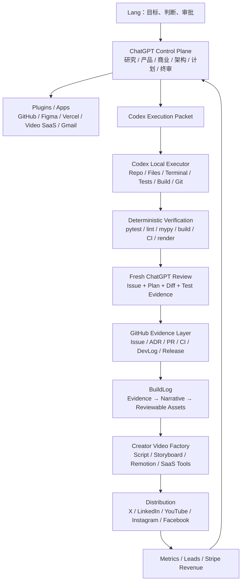

# Master System Map

## 1. 总系统



## 2. 两条主线

### Track A — SoloScale Core

解决：

- 任务应该交给 Chat、Plugin、Codex、Runtime 还是 Human？
- 如何避免 Chat 和 Codex 重复分析同一问题？
- 如何把计划、审批、执行、测试、审查保存为证据？
- 如何从手动流程逐步变成确定性本地编排和云端控制面？

### Track B — Creator Revenue & Video

解决：

- 如何把真实工程工作变成大量高质量内容？
- 如何不用每次真人重录，仍保留个人品牌可信度？
- 如何把一个 Evidence Source 改写成不同平台的 Native Asset？
- 如何把流量导向公司域名、邮箱、Stripe 产品与服务？
- 如何让评论、线索和收入重新影响产品 Backlog？

## 3. 共享资产层

两条主线不能各自创建一套事实。

统一保存：

```text
Task
Decision
Plan
Approval
Execution
Diff
Tests
Review
Result
Metrics
Narrative
Publication
Revenue Attribution
```

推荐统一 ID：

```text
task_id
run_id
source_repository
source_commit
content_id
campaign_id
offer_id
publication_id
```

## 4. Personal Mode 与 Runtime Mode

### Personal Mode

利用现有 ChatGPT 订阅和已连接 Plugin：

```text
ChatGPT 推理
→ Plugin 在线动作
→ Codex 本地执行
→ 人工批准
```

适合：

- 项目规划
- 内容策划
- 一次性研究
- 本地开发
- 在线设计与部署
- 手动发布

### Runtime Mode

使用 API 和确定性编排：

```text
API Planner
→ State Machine
→ Codex / Tool Executor
→ Verifier
→ API Reviewer
→ Human Gate
```

只适合：

- 实时用户请求
- 定时任务
- Webhook
- 自动重试
- 无人值守服务
- 多用户产品

不要为了“自动化感”过早把 Personal Mode 全部改成 API Runtime。

## 5. 系统成功定义

SoloScale 成功，不是因为 Agent 数量多，而是因为：

```text
同一件事只推理一次
正确的工具获得正确的上下文
执行有边界
验证有事实
关键动作有人批准
结果可以复现和传播
```
