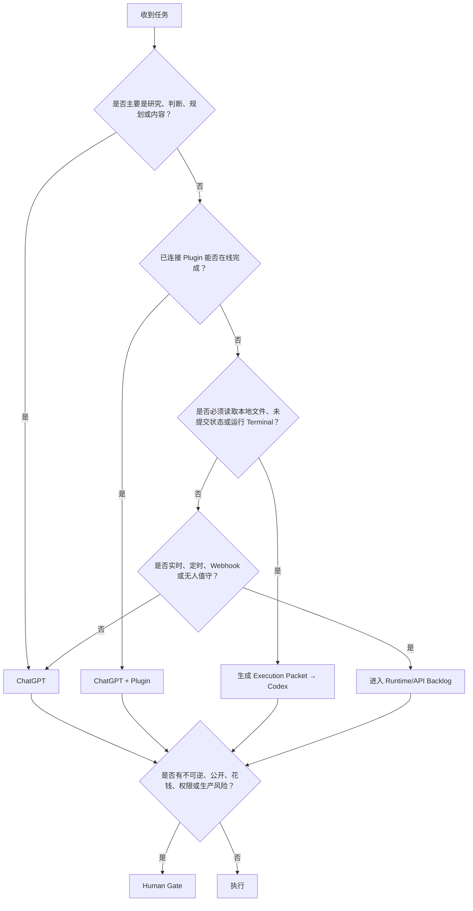

# 严格分工与 Token 节省政策

## 1. 默认路由

| 任务类型 | 默认负责人 | 典型输出 |
|---|---|---|
| 研究、商业、产品、架构、内容策略 | ChatGPT | 决策、计划、Brief、风险、Execution Packet |
| GitHub/Figma/Vercel 等在线动作 | ChatGPT + Plugin | Issue、设计稿、Preview、云端记录 |
| 本地文件、未提交代码、终端、测试 | Codex | Diff、测试、构建、工程报告 |
| 事实验证 | 本地工具 / CI | exit code、日志、构建产物 |
| 独立终审 | 新 ChatGPT 对话 | P0/P1/P2、合并结论 |
| 实时、重复、事件驱动流程 | API Runtime | 服务、队列、定时任务 |
| 公开、收费、部署、权限、生产数据 | Human | 明确批准或拒绝 |

## 2. 决策树



## 3. ChatGPT 的职责

ChatGPT 应负责尽可能多的非本地工作：

- 需求澄清
- 市场与用户研究
- 商业模式和 Offer
- 产品范围和 Non-goals
- 技术架构与 Tradeoff
- GitHub Issue / ADR / PR Review 文案
- Figma / Vercel / 其他 Plugin 动作
- Creator Benchmark 与内容策略
- Script、Storyboard、Carousel、Landing Page Copy
- Fresh-context 代码审查
- 周计划、优先级、复盘

ChatGPT 不应该在 Codex 即将实施时输出几百行完整代码；它应输出**明确、短、可验证的执行包**。

## 4. Codex 的职责

Codex 只处理真正需要本地工程能力的工作：

- 读取真实 Repo
- 查找 Symbol 与数据流
- 做最小必要修改
- 运行安装、测试、Lint、Type Check、Build
- 根据真实错误做局部修复
- 生成 Diff、变更报告和 Evidence Pack
- 构建 Remotion 模板、FFmpeg 脚本和本地视频流水线
- 本地打包、Wheel、Docker、制品
- 在明确批准后执行 Git Branch / Commit / Push 等工程动作

## 5. Codex 禁止承担的工作

除非本地实现被阻塞，否则不要把以下任务交给 Codex：

- 市场研究
- 商业战略
- 自媒体平台策略
- Creator 选题与竞品蒸馏
- 在线 Figma/Vercel/GitHub 元数据动作
- 开放式系统架构辩论
- “先理解整个产品再看看”
- 重复 ChatGPT 已完成的方案比较
- 跨平台内容批量改写
- 长篇思想总结
- 对同一个问题启动多个子 Agent 讨论

## 6. Token 最省的交接

错误方式：

```text
整个聊天记录
+ 整个 Repo
+ 模糊要求
→ Codex 从头再想
```

正确方式：

```text
Issue
+ Frozen Decisions
+ Approved Plan
+ Execution Packet
+ Stop Conditions
→ Codex 局部验证并实施
```

## 7. 多 Agent 政策

默认拓扑：

```text
One Strong Planner
→ One Local Executor
→ One Fresh Reviewer
→ Human Gate
```

只有满足以下任一条件才增加 Agent：

- 子任务真正互不依赖，可以并行
- Agent 拥有不同必要工具
- Agent 拥有不同权限
- 需要独立数据源
- 高风险任务值得异构模型复核
- 任务大到必须分成不冲突的 Worktree

以下情况不增加 Agent：

- 只是想听更多相似意见
- 只是为了显得“Agentic”
- 同一上下文中重复总结
- 多个 Agent 会同时写同一文件
- 协调成本大于执行成本

## 8. 上下文政策

- 一个 Chat 对应一个明确结果。
- 一个 Codex Thread 对应一个有边界的本地工程任务。
- Reviewer 必须使用新的 Chat。
- 长期事实写入 Architecture / ADR。
- 单任务事实写入 Issue / Plan / Execution Packet。
- 临时事实写入 Diff / Test Log / Evidence Pack。
- 不让聊天历史成为唯一 Source of Truth。
