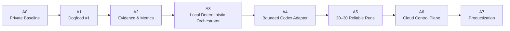

# SoloScale Core Roadmap

## 当前定位

当前阶段应定义为：

```text
Private Local Alpha / Dogfood-Ready Baseline
```

不是概念 Demo，也不是已验证的云端产品。

## 路线总览



## A0 — Private Baseline

### 已知输入状态

- Private GitHub readiness：PASS
- Public readiness：FAIL
- First dogfood CLI path：PASS
- Clean-room 与基础 CI 已通过
- Reviewer 仍是 `same-session self-review`

### 不再做

- 不继续加抽象层
- 不继续扩张 Agent 数量
- 不先做 Dashboard
- 不先云端部署

---

## A1 — Dogfood #1：Research Agent Source-Grounded Citations

### 目标

证明一套 Chat-first、Codex-local 的流程可以完成真实跨文件功能。

### 完整链路

```text
ChatGPT 规划
→ GitHub Issue
→ Human Plan Approval
→ SoloScale Execution Packet
→ Codex 本地实现
→ Deterministic Verification
→ GitHub PR / CI
→ Fresh ChatGPT Review
→ P0/P1 修复
→ BuildLog Evidence
```

### 退出条件

- PR 存在
- CI 通过
- 无未解决 P0/P1
- Reviewer 使用 Fresh Context
- Evidence Pack 完整
- BuildLog 成功消费
- 记录真实流程指标

---

## A2 — Evidence & Metrics Baseline

增加但不自动推理：

```text
events.jsonl
metrics.json
route-decision.json
approval-receipt.json
verification.json
review.json
buildlog-iteration.json
```

### 需要记录

- Chat planning turns
- Codex implementation turns
- Verification cycles
- Repair cycles
- Human interventions
- Manual handoffs
- Files inspected / changed
- Wall-clock duration
- Usage 或 API cost：只有可观察时记录
- Evidence completeness

### 退出条件

连续 3 个不同任务都生成完整 Evidence。

---

## A3 — Local Deterministic Orchestrator

### 普通代码负责

- 状态转换
- 重试上限
- Budget
- Gate
- 文件存在性
- Exit code
- Evidence 完整性

### LLM 负责

- 计划
- 复杂实现
- 代码审查
- 创造性内容

### 状态机

```text
NEW
→ TRIAGED
→ PLANNED
→ APPROVED
→ EXECUTING
→ VERIFYING
→ REVIEWING
→ ACCEPTED
→ CLOSED
```

失败路径：

```text
VERIFY_FAILED
→ FIXING
→ VERIFYING
```

最多两轮自动修复。

---

## A4 — Bounded Codex Adapter

只在 A1–A3 稳定后实现。

### 目标

通过 Codex SDK、CLI 或 MCP 让控制器能够：

```text
start bounded task
resume bounded task
receive structured report
stop on guardrail
```

### 权限

```text
Planner / Reviewer → read-only
Executor → workspace-write
Full access → 默认禁止
```

### 不允许

- Codex 自己决定扩大 Scope
- Codex 自己进入部署、发布或权限变更
- Codex 无限制探索整个 Repo
- Codex 无限重试

---

## A5 — Reliability Gate

云端之前至少完成：

```text
20–30 次本地真实 Run
3 种任务类型
至少 2 个不同目标 Repo
可中断恢复
无秘密泄露
预算和重试可控
```

需要回答：

- 哪类路由最容易错？
- Execution Packet 多长最有效？
- Fresh Review 是否发现真实问题？
- 哪些动作仍需手动？
- 哪些自动化带来负收益？

---

## A6 — Cloud Control Plane

只有通过 A5 才进入：

```text
FastAPI
PostgreSQL
Queue / Worker
Artifact Store
Sandbox
Auth
Run Dashboard
Cost Dashboard
Webhook
Scheduled Runs
```

先做单用户或内部版，不先做 Multi-tenant Billing。

---

## A7 — Productization

可选方向：

- SoloScale Starter Kit
- Team Agent Control Plane
- Hosted SoloScale
- Creator Revenue OS
- Engineering Evidence OS
- Workflow Audit 服务
- 企业内部 Agent 编排实施
