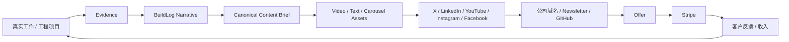
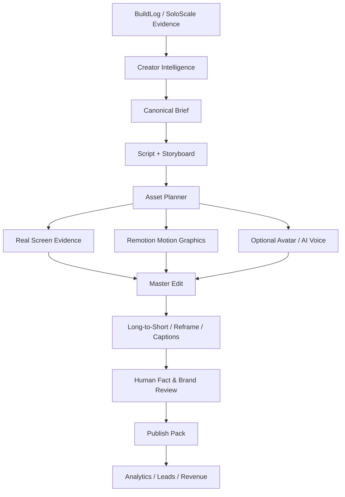

# Creator Revenue & Video Factory Roadmap

## 1. 商业闭环



## 2. 收入顺序

优先顺序：

```text
1. 咨询与产品化服务
2. 数字产品与模板
3. 订阅 / SaaS / 社区
4. 品牌合作与 Affiliate
5. 平台原生分成
```

平台分成不是起点。你已有 LLC、公司域名、邮箱和 Stripe，因此可以在粉丝门槛前先卖明确 Offer。

## 3. 平台职责

| 平台 | 主要作用 | 内容 |
|---|---|---|
| LinkedIn | B2B 信任、客户、招聘、合作 | Case Study、架构、Carousel、长帖 |
| X | 技术传播、Founder Network、Build in Public | Thread、观点、短视频、实验 |
| YouTube | 长期搜索、深度信任、教程 | 8–15 分钟视频、Shorts |
| Instagram | 视觉传播、个人品牌 | Reels、Carousel、幕后 |
| Facebook | Reels、社群与更广泛分发 | 视频、图文、Group |
| Twitch / Live | 后期长素材与社区 | Live Coding、Q&A |

第一阶段主动经营：

```text
LinkedIn + X + YouTube
```

Instagram / Facebook 作为适配分发，直播暂不强制。

## 4. 高质量快速流

快速流不等于批量生成无证据内容。

正确结构：

```text
一个原创 Evidence Source
→ 10 个不同命题
→ 每个命题一个 Hook
→ 不同平台不同画面和 CTA
```

推荐比例：

- 70%：15–60 秒短内容
- 20%：2–5 分钟中内容
- 10%：8–15 分钟长内容

## 5. 视频系统



## 6. 工具分工

### Codex 构建、长期拥有

- Remotion React 视频模板
- FFmpeg 组合与编码
- Content Manifest
- 字幕、画幅与品牌配置
- Evidence / Claim 校验
- 本地 Render
- 批量打包
- Provenance
- 成本和版本记录

### 成熟 SaaS 加速

- 屏幕录制与 Transcript 编辑：Descript 或同类
- 数字分身：HeyGen 或同类
- 长视频切短：OpusClip 或同类
- 视觉设计：Figma
- 排程与分析：平台原生工具或统一分析工具

原则：

```text
现成工具负责速度
自有代码负责差异化、证据、品牌一致性和可扩展性
```

## 7. Roadmap

### B0 — 品牌与 Offer

确定：

```text
个人品牌：
How one person builds and monetizes AI systems

公司品牌：
SoloScale / BuildLog / AI workflow products
```

首批 Offer：

- 免费：Solo AI Workflow Map
- 低价：Execution Packet / Carousel / Workflow Template
- 服务：AI Workflow Architecture Audit
- 高价：AI Agent MVP Sprint

### B1 — Canonical Evidence-to-Content

输入统一为：

```text
Task + Decisions + Diff + Tests + Result + Lessons
```

输出：

```text
canonical-content-brief.json
claims.json
evidence-map.json
```

### B2 — Creator Skill Distillation

首批样本：

```text
10–20 个同赛道创作者
每人 10–20 条代表内容
总计 200–400 条
```

提取：

- Positioning
- Audience
- Hook archetypes
- Narrative structure
- Proof style
- Pacing
- Visual grammar
- CTA
- Funnel

不能复制脸、声音、句子或独特身份；只蒸馏可抽象的技巧。

### B3 — Creator Video Factory v0.1

由 Codex 构建三个模板：

```text
EngineeringShort 9:16
ArchitectureExplainer 16:9
EvidenceCarouselMotion 4:5
```

v0.1 不调用付费 API，不自动发布。

### B4 — 第一批 10 个视频

围绕 SoloScale 真实证据：

1. 28 tests passed，为什么仍不能公开
2. Same-session self-review 不等于独立审查
3. ChatGPT 是大脑，Codex 是本地执行器
4. 为什么需要 Approval Receipt
5. 一段发散对话如何变成 Python Package
6. Private-ready 不等于 Public-ready
7. 什么是 Clean-room Audit
8. 为什么状态机比 Agent 自由循环可靠
9. 如何减少重复上下文
10. 一人公司如何获得小团队生产力

### B5 — 公司域名与 Stripe Funnel

公司网站至少包含：

```text
Homepage
Free Lead Magnet
Low-ticket Product
AI Workflow Audit
AI Agent MVP Sprint
Newsletter
GitHub Proof
```

### B6 — Distribution & Analytics

先手动/半自动发布。

追踪：

```text
3-second hold
completion rate
saves
shares
profile visits
GitHub clicks
email signups
qualified leads
calls
purchases
revenue per content asset
```

### B7 — Scale

只有当某个 Format 和 Offer 已有稳定结果，再接：

- Avatar API
- Voice API
- Clipping API / MCP
- Scheduler API
- Analytics API
- Cloud Render Worker
- 自动实验与归因

## 8. 购买 Gate

- 没有生产 10 条视频前，不同时购买多个付费工具。
- 工具只有解决已测量的瓶颈才升级。
- 不因“可能有用”购买年付。
- 定价和功能随时变化，购买前重新核验。
